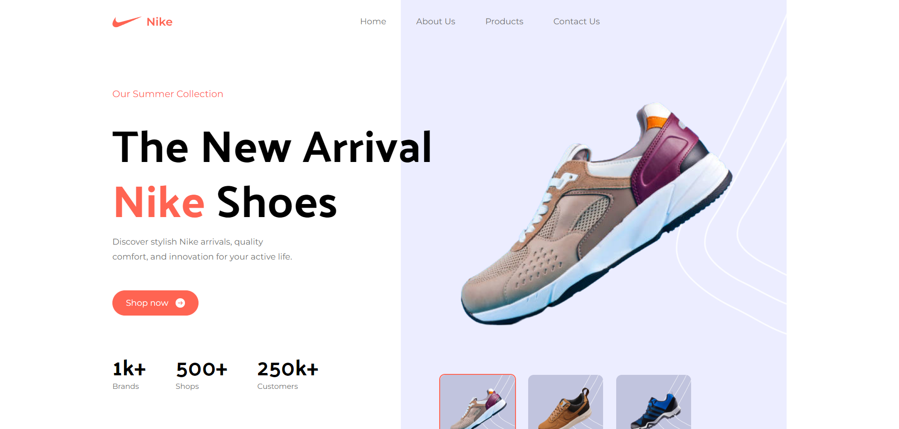

  

# 🐱‍🏍 Nike Website

Projeto de uma landing page 2.0 da Nike.

- Veja o projeto: [Live Preview](https://nike-website-victtor.vercel.app/)

## ⚙️ Funcionalidades

- [x] ;
- [x] ;
- [x] Site totalmente responsivel;
- [x] Feito usando Tailwind...;

## 🚀 Tecnologias

- [TypeScript](https://www.typescriptlang.org/)
- [React](https://react.dev/)
- [Tailwind](https://nextjs.org/)

## 📝 Considerações

Projeto de uma landing page da Nike, fiz para aprender tailwind e práticar meus conhecimentos em Typescript e React.
